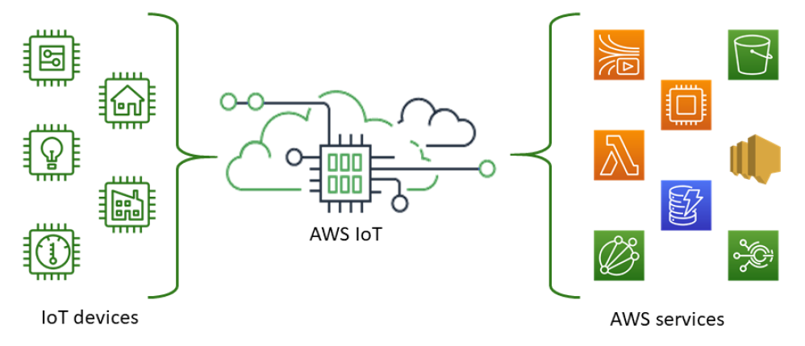
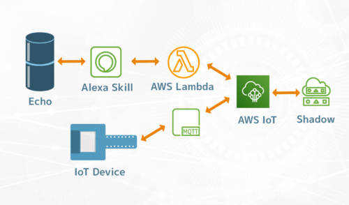
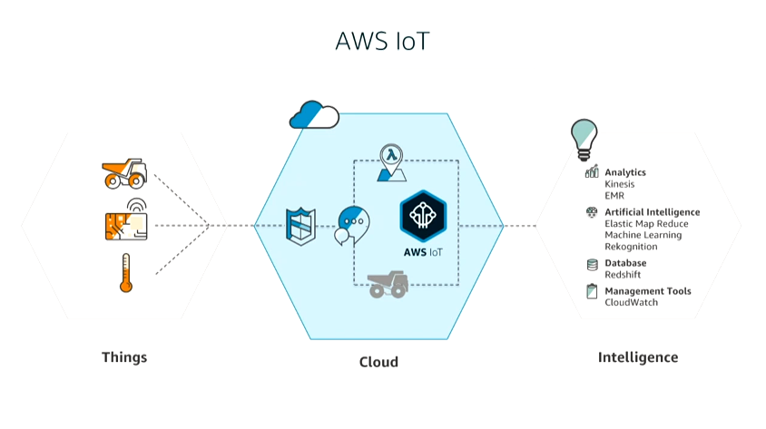

# ¿Qué es AWS IoT?
>AWS IoT proporciona los servicios en la nube que conectan los dispositivos IoT a otros dispositivos y servicios en la nube de AWS. AWS IoT proporciona software para dispositivos que puede ayudarlo a integrar los dispositivos IoT en soluciones basadas en AWS IoT. Si los dispositivos se pueden conectar a AWS IoT, AWS IoT puede conectarlos a los servicios en la nube que proporciona AWS.  
  

AWS IoT le permite seleccionar la opción más adecuada y tecnologías up-to-date para su solución. Para ayudarlo a administrar y dar soporte a sus dispositivos de IoT en el campo, AWS IoT Core admite los siguientes protocolos:  
* MQTT (Message Queue Server y transporte de telemetría)  

  

* MQTT sobre WSS (Websockets Secure)
* HTTPS (protocolo de transferencia de hipertexto: seguro)
* LoRaWAN (red de área amplia de largo alcance)  

En el diagrama siguente se muestra una descripción general de cómo AWS IoT se integra con otros dispositivos y servicios de AWS.  

