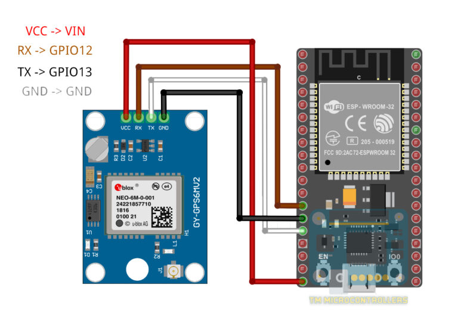
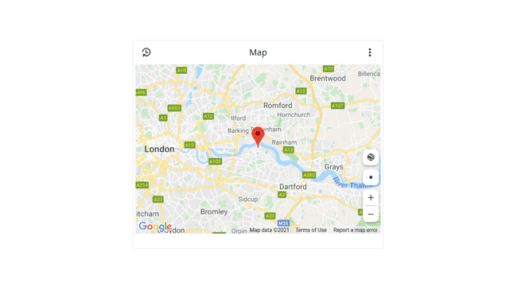
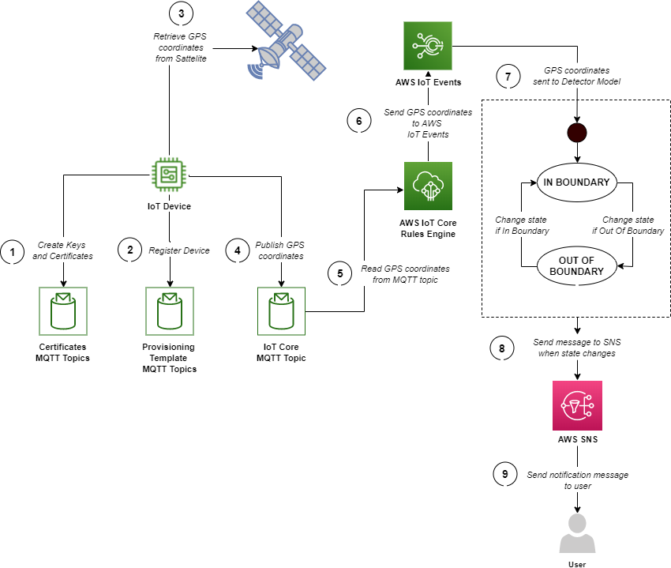

## Hardware necesario  
* Placa de desarrollo ESP32
* Módulo GPS GY-NEO6MV2
* Conexión de cables

## Cableado  

  

## Visualización de la ubicación de ESP32 en el servidor local
Alrededor del 80% del código proviene del código del servidor web ESP32. Solo necesitamos añadir las siguientes bibliotecas:

* ESPSoftwareSerial
* TinyGPS  

Una vez instaladas estas bibliotecas, tendremos que declarar los siguientes objetos en algún lugar antes de setup():  
<code> 
TinyGPS gps;  
SoftwareSerial ss; 
</code>  

Para leer las coordenadas GPS, utilizamos:  
<code> 
gps.f_get_position(&flat, &flon, &age);  
</code>  
Esta función devuelve la latitud y longitud a las variables flat y flon que son flotadores. La variable age es double.  

Llamamos a esta función cada vez que un usuario/cliente accede a la página < Dirección IP >ESP32/loc. Dado que necesitamos una String para enviar a través de HTTP, las variables flat y flon se convierten primero.  

```
server.on("/loc", [](){
   gps.f_get_position(&flat, &flon, &age);
   text = floatToString(flat,TinyGPS::GPS_INVALID_F_ANGLE, 10, 6) + ',';
   text += floatToString(flon,TinyGPS::GPS_INVALID_F_ANGLE, 11, 6);
   if(text.indexOf("v") > 0){
      text = "7.207573, 125.395874";
   }
   Serial.println(text);
   server.send(200, "text/plain", text);
   smartdelay(500);
});

``` 

El resto de los archivos contienen páginas web HTML, JS y CSS convertidas en archivos de encabezado de C++. El HTML y el CSS son solo copias del ejemplo de Simple Map de Google. La mayor parte del trabajo está en el archivo JS.  
Básicamente, en el código JS tenemos tres funciones: initMap(), getPosition() y changeMarkerPosition(). La función initMap() carga el mapa y traza un marcador inicial. También dentro de esta función hay un setInterval() que adquiere la posición del dispositivo cada segundo.  
Para cada desencadenador setInterval(), se llama a la función getPosition(). Contiene un XMLHttpRequest() a la página < Dirección IP >/loc. Si la solicitud se realiza correctamente, se recuperan las coordenadas GPS.  
Después de extraer la latitud y la longitud, la función changeMarkerPosition() cambia la posición del marcador mediante la función setPosition(). Finalmente, para que el mapa se mueva con el marcador, establecemos su centro igual que las coordenadas GPS actualizadas.  

## <code> Envío de datos GPS a un servidor web externo. </code>
Una aplicación más práctica de este proyecto es tener los archivos de la página web almacenados en un servidor web externo. Primero, necesitamos cargar los archivos HTML, JS y CSS en el servidor y luego cambiar algunas líneas en el código ESP32. El ESP32 ahora actuará como cliente y enviará datos GPS a través de HTTP POST.

La función loop() del código ESP32 contiene las partes donde se adquieren los datos GPS y el envío al servidor:  
```
void loop(void) {
  // Send GPS data every second
  gps.f_get_position(&flat, &flon, &age);
  gpsData = "lat="+floatToString(flat,TinyGPS::GPS_INVALID_F_ANGLE, 10, 6) + "&lng=";
  gpsData += floatToString(flon,TinyGPS::GPS_INVALID_F_ANGLE, 11, 6);
  if(gpsData.indexOf("v") > 0){
      gpsData = "lat=7.207573&lng=125.395874";
  }
  Serial.println(gpsData);
  smartdelay(1000);
  
  HTTPClient client;
  
  client.begin(server);
  client.addHeader("Connection","keep-alive");
  client.addHeader("Content-Length",String(gpsData.length()));
  client.addHeader("Content-Type", "text/plain");
  int httpResponseCode = client.POST(gpsData);
 
  Serial.println(client.getString());
  if(httpResponseCode > 0){
    Serial.println("Data successfully sent to server!");      
  }else{
    Serial.print("Server upload failed. ");
    Serial.println(client.errorToString(httpResponseCode).c_str());
  }
  // Free resources
  client.end();
}
```  
Luego, agregamos un archivo gps.php, para capturar los datos POST del ESP32:  
``` 
<?php
    $inp = file_get_contents("php://input");
    if(!empty($inp)){
        $s = explode("&",$inp);
        $a = explode("=",$s[0]);
        $b = explode("=",$s[1]);
        // Replace this with another method that saves to DB
        $file = fopen("gps_data.txt", "w") or die("Unable to open file!");
        $txt = $a[1] . "," . $b[1];
        fwrite($file, $txt);
        fclose($file);
    }else{
        // Replace this with another method to reads from DB
        $file = fopen("gps_data.txt", "r") or die("Unable to open file!");
        echo fread($file,filesize("gps_data.txt"));
        fclose($file); 
    }
?>
```  
Además de capturar datos POST, el archivo PHP anterior también proporciona los últimos datos GPS transmitidos enviados.

# <code> Arduino IOT cloud </code>  

Todo lo anterior se simplifica mucho al utilizar plataformas como Arduino IOT cloud, la cual nos provee de herramientas que nos facilitan las tareas.  
El widget de mapa es una herramienta para realizar un seguimiento de la ubicación de sus proyectos. Esta es una gran herramienta para cualquier proyecto que involucre GPS, o para obtener una visión general de dónde están operando su Cosa, o varias Cosas.

Se puede vincular con la variable Location.

Un ejemplo de cómo se usa en un boceto: 

```locationVariable = Location(51.5074, 0.1278);```



# <code> AWS IoT core </code>  

La estructura que provee AWS para el mismo fin se resume en la siguiente imagen:

